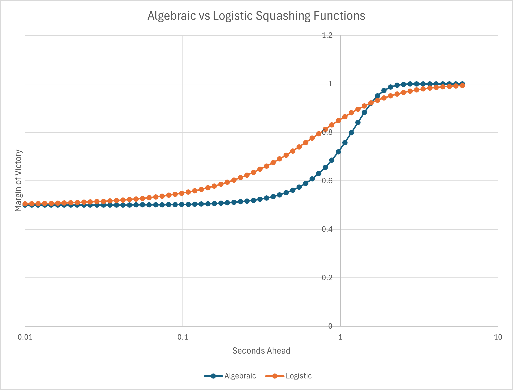

# eloCalc

Java implementation of an ELO model. 

Partially inspired by this [blog post](http://www.matterofstats.com/mafl-stats-journal/2013/10/13/building-your-own-team-rating-system.html) and also this [YouTube video](https://www.youtube.com/watch?v=U16a8tdrbII).

The aim is to build off this [kaggle dataset]() which I believe comes from this [cool API](http://ergast.com/mrd/) which unfortunately is being depreciated. 

However, the main aim is to build a general purpose ELO Engine that can be turned to any sport (if the DB is set up correctly).

## Resources

Occaisionally, there will be mutliple ways of calculating a score. I will try to update the xlsx file in `/resources` to keep a track of what each of these look like - even if it's just a graph of f(x).

## Implementation

I'm using Java to try to make this a bit more efficient (and to practice). I will try to use best practices, but I am not a software engineer (see mention of MS Excel above).

### F1 Squashing Function

As we can see below, a logistic squashing function ($f(m) = \frac{1}{1+e^{-m^2}}$) gives a slightly nicer curve for closer finishes. The algebraic option ($f(m) = \frac{1}{2} (1 + \frac{1}{\sqrt{1+{m^{2}}}} )$) is more concave, which isn't great.

This is also true on a log scale:

We may have to transform the margin further to capture larger margins of victory (divide by 10 as an example) - but this will do for now.

## Other resources

This [medium post](https://mattmazzola.medium.com/implementing-the-elo-rating-system-a085f178e065)

For football, this [kaggle dataset](https://www.kaggle.com/code/abhimanyumehta26/football-match-pred) looks a good starting point.